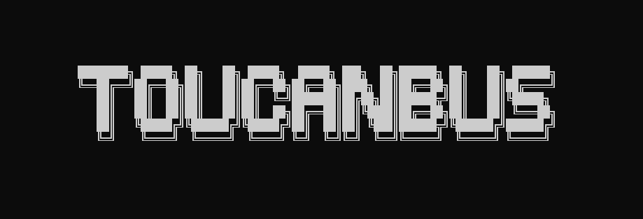

<div align="center">

  

  <h1>TOUCANBus</h1>

  <p><strong>An advanced, streamlined automation suite for automotive penetration testing and SocketCAN interaction.</strong></p>

  <p>
    
    
    
    
  </p>

</div>

---

## 📌 Overview

**TOUCANBus** is a feature-rich, terminal-based dashboard designed to bridge the gap between complex `can-utils` commands and practical automotive security research. Built for field researchers, security professionals, and automotive engineers, it provides a clean, modular workflow for recording, filtering, parsing, decoding (via DBC files), and fuzzing CAN bus traffic.

---

## ✨ Key Capabilities

| Feature | Description |
| :--- | :--- |
| **Live Recording & Filtering** | Capture live SocketCAN bus traffic into structured log files with real-time ID filtering. |
| **Real-Time Diagnostics** | Monitor live CAN bus packets instantly using an integrated `cansniffer` interface. |
| **Log File Manager** | Select, inspect, and switch between saved capture sessions on the fly. |
| **Parser & DBC Decoder** | Search logs, strip noise, or automatically translate raw hex payloads into human-readable signals (RPM, Speed, Throttle) using standard `.dbc` profiles. |
| **Replay Attacks** | Seamlessly stream recorded log sessions back onto the target CAN bus via `canplayer`. |
| **Automated Fuzzer Suite** | Execute targeted fuzzing attacks, including Incremental Byte, Random Entropy, and UDS Service ID brute-forcing. |
| **Precision Injection** | Transmit single custom-tailored CAN frames (`can_id#data`) directly to the bus. |
| **Filter Management** | Build, save, and apply custom masking rules to isolate specific Electronic Control Units (ECUs). |

---

## 🎯 Use Cases

* **Vehicular Penetration Testing:** On-field and off-field security assessments of in-vehicle networks.
* **Diagnostics & Troubleshooting:** Analyzing error frames, diagnostic trouble codes (DTCs), and check-engine states.
* **Research & Prototyping:** Gaining a hands-on understanding of the Controller Area Network (CAN) protocol and message structures.
* **Hardware Demonstrations:** Rapid deployment for interactive vehicle control projects.

---

## 🛠️ Hardware Requirements

1. **CAN Interface:** USB-to-CAN adapter (e.g., [8devices USB2CAN](https://www.8devices.com/products/usb2can_korlan) or any SocketCAN-compatible interface like CANable / CandleKey).
2. **Compute Device:** Raspberry Pi (Recommended for portable field operations) or a Linux workstation.
3. **Power Supply & Cabling:** Appropriate power source and an OBD-II to DB9 diagnostic cable mapping.

---

## ⚙️ Setup & Installation

### 💻 Standard Linux Workstation
1. Clone the repository:

 ```bash
   git clone https://github.com/her3ticAVI/TOUCANBus.git
   cd TOUCANBus
```

2. Launch the utility with root privileges (required for SocketCAN interface binding):

```bash
  sudo python3 toucanbus.py
```


### 🥧 Headless Raspberry Pi Configuration

1. Deploy a Raspberry Pi running Raspberry Pi OS.
2. (Optional) Install [RaspAP](https://github.com/RaspAP/raspap-webgui) to handle remote network connectivity and web management.
3. Clone the repository onto the device, connect your hardware interface to the vehicle's OBD-II port, and initiate the suite via SSH:
```bash
sudo python3 toucanbus.py

```


---

## 🤝 Contributing

Contributions, bug reports, and feature requests are welcome. Feel free to open an issue or submit a pull request for review.

---
